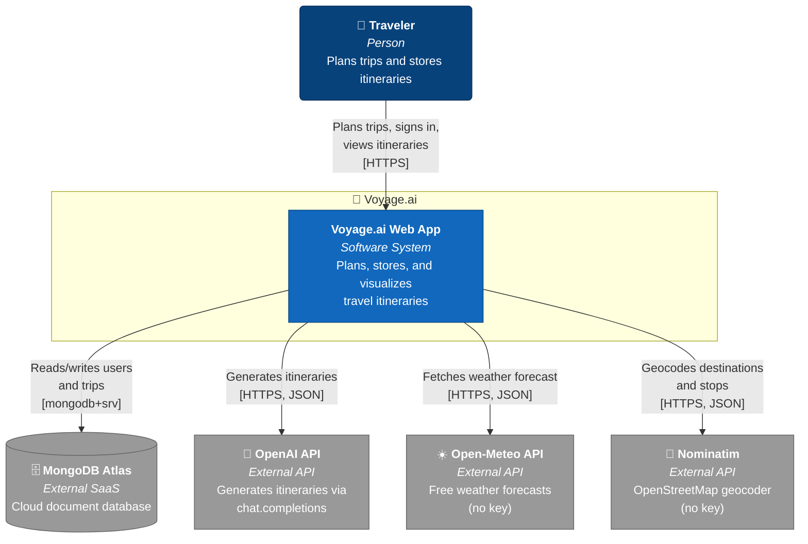
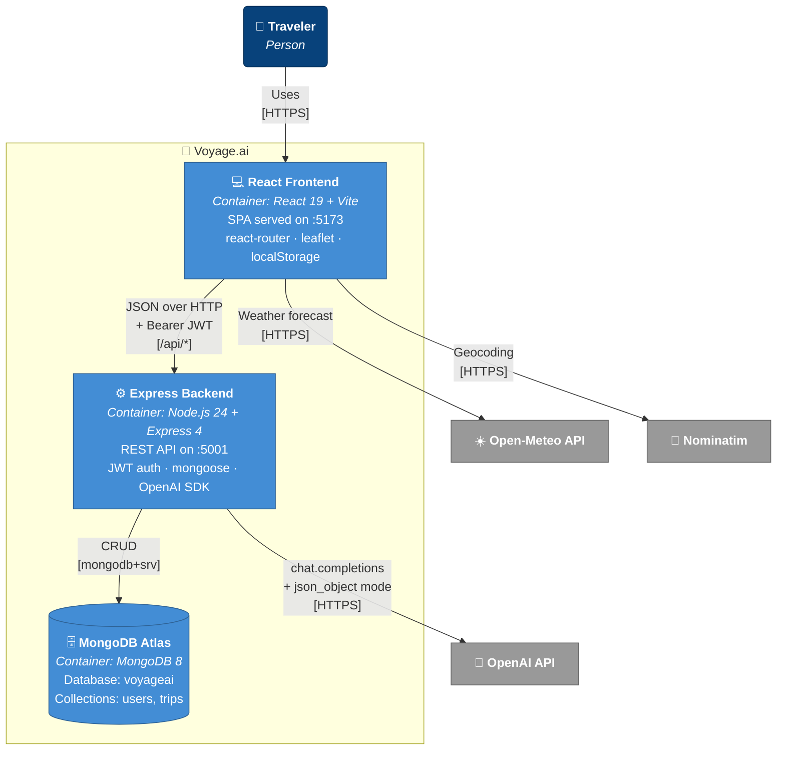

# Voyage.ai — C4 Architecture Diagrams

Three levels of architecture diagrams for the Voyage.ai trip-planning app,
following the [C4 model](https://c4model.com/). Rendered with Mermaid.

---

## Level 1 — System Context

The user interacts with Voyage.ai. Voyage.ai depends on four external systems:
MongoDB Atlas for storage, OpenAI for itinerary generation, Open-Meteo for
weather forecasts, and Nominatim for geocoding place names to coordinates.



---

## Level 2 — Container

Voyage.ai is a two-tier application: a React/Vite frontend talks to a
Node.js/Express backend, which persists to MongoDB Atlas. External APIs are
called from both tiers — the backend calls OpenAI; the frontend calls
Open-Meteo and Nominatim directly from the browser.



---

## Level 3 — Component (Backend)

Zooming into the Express backend. The entry point (`server.js`) loads env vars
and connects to MongoDB, then mounts the Express `app` defined in `app.js`.
Three route modules are mounted under `/api`, all protected by the `requireAuth`
middleware (except `/api/auth/register` and `/api/auth/login`). Routes use
Mongoose models to read/write the database.

```mermaid
flowchart TB
    frontend["💻 <b>React Frontend</b><br/><i>External Container</i>"]
    mongo[("🗄️ <b>MongoDB Atlas</b>")]
    openai["🤖 <b>OpenAI API</b>"]

    subgraph backend["⚙️ Express Backend"]
        server["<b>server.js</b><br/><i>Entry point</i><br/>Loads .env, connects DB,<br/>starts listener on :5001"]
        app["<b>app.js</b><br/><i>Express app</i><br/>CORS · JSON parser<br/>Mounts routes"]
        db["<b>config/db.js</b><br/><i>Bootstrap</i><br/>mongoose.connect(MONGO_URI)"]

        authRoutes["<b>routes/auth.js</b><br/><i>Router</i><br/>POST /register<br/>POST /login<br/>GET /me<br/>PUT /me"]
        tripRoutes["<b>routes/trips.js</b><br/><i>Router</i><br/>GET, GET/:id, POST,<br/>PUT/:id, DELETE/:id<br/>(all auth-protected)"]
        planRoutes["<b>routes/plan.js</b><br/><i>Router</i><br/>POST /<br/>Calls OpenAI, parses JSON,<br/>saves trip"]

        authMw["<b>middleware/auth.js</b><br/><i>Middleware</i><br/>requireAuth — verifies JWT,<br/>attaches req.userId<br/>signToken — issues JWT"]

        userModel["<b>models/User.js</b><br/><i>Mongoose model</i><br/>email · passwordHash · name<br/>toJSON strips passwordHash"]
        tripModel["<b>models/Trip.js</b><br/><i>Mongoose model</i><br/>userId · title · where · days[]<br/>budget · timestamps"]
    end

    frontend -- "POST /api/auth/*<br/>[no token needed for<br/>register/login]" --> authRoutes
    frontend -- "/api/trips/*<br/>[Bearer JWT]" --> tripRoutes
    frontend -- "POST /api/plan-trip<br/>[Bearer JWT]" --> planRoutes

    server --> db
    server --> app
    db -- "mongodb+srv" --> mongo
    app --> authRoutes
    app --> tripRoutes
    app --> planRoutes

    tripRoutes -- "all routes" --> authMw
    planRoutes -- "POST /" --> authMw
    authRoutes -- "GET/PUT /me" --> authMw

    authRoutes -- "find · create · update" --> userModel
    tripRoutes -- "find · create · update ·<br/>findOneAndDelete" --> tripModel
    planRoutes -- "create" --> tripModel
    authMw -- "(no DB)" -.- userModel

    userModel -- "users collection" --> mongo
    tripModel -- "trips collection" --> mongo
    planRoutes -- "chat.completions<br/>(json_object mode)" --> openai

    classDef container fill:#438dd5,stroke:#2e6295,color:#fff
    classDef ext fill:#999,stroke:#666,color:#fff
    classDef component fill:#85bbf0,stroke:#5d82a8,color:#000
    classDef db fill:#438dd5,stroke:#2e6295,color:#fff
    class frontend container
    class mongo db
    class openai ext
    class server,app,db,authRoutes,tripRoutes,planRoutes,authMw,userModel,tripModel component
```

---

## Notes

- **Auth model:** stateless JWT with 7-day expiry, secret stored in `JWT_SECRET`.
  Token issued by `signToken(userId)`, verified by `requireAuth` middleware.
- **Data ownership:** every `Trip` document has a `userId` and queries filter
  by `req.userId`, so users only ever see their own trips.
- **AI integration:** `routes/plan.js` calls `chat.completions.create()` with
  `response_format: { type: "json_object" }` and `max_completion_tokens: 8192`,
  then auto-saves the result as a Trip owned by the requesting user.
- **External APIs from the browser:** Open-Meteo and Nominatim are called
  directly from the React components (`WeatherStrip`, `TripMap`) — no backend
  proxy. Both are free and CORS-friendly. Nominatim is rate-limited to
  ~1 request/second per their ToS.
